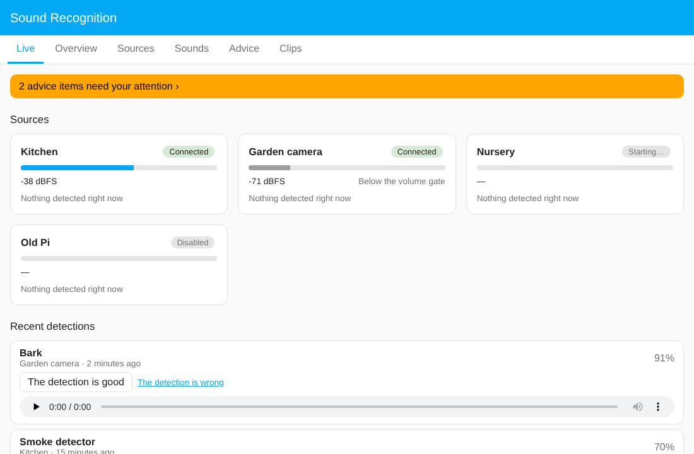
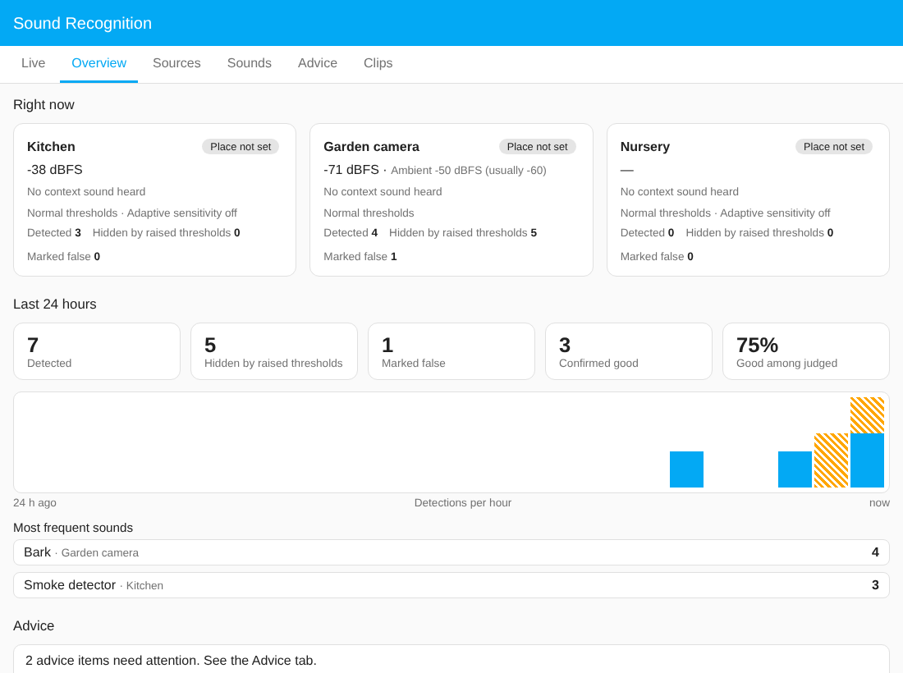
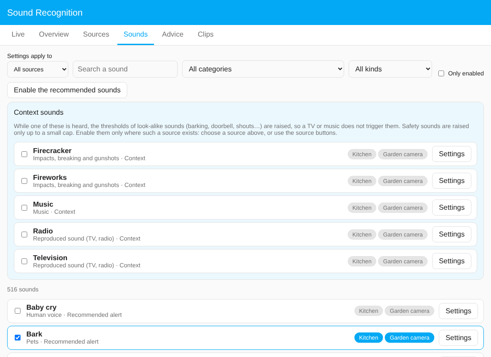
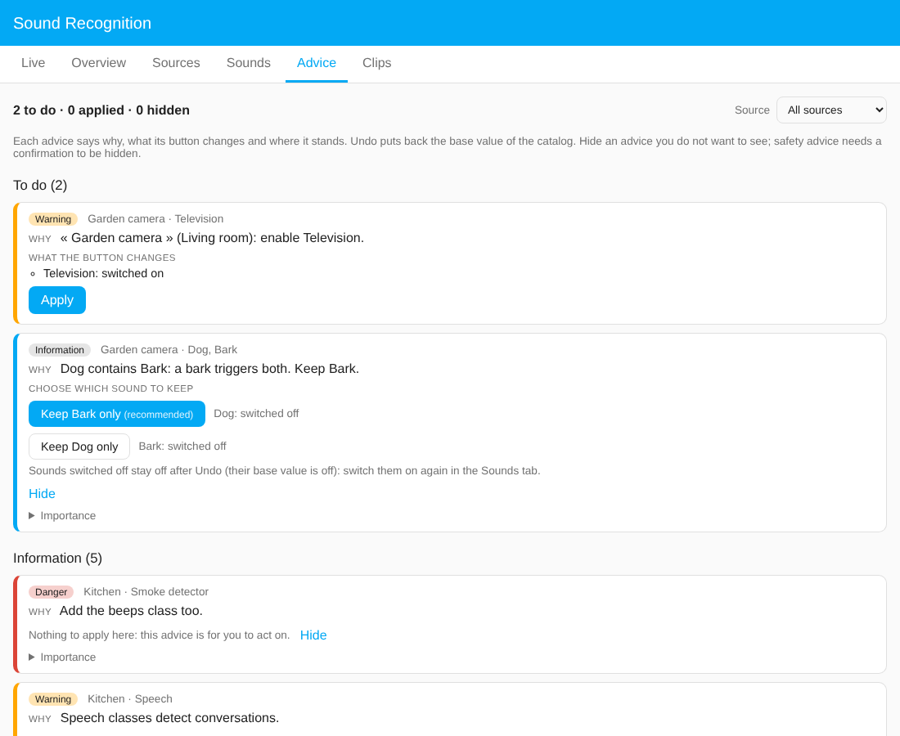

# Sound Recognition for Home Assistant

Recognises sounds (smoke alarm, baby cry, doorbell, breaking glass, barking…) from network microphones, cameras and Raspberry Pi, and reports them to Home Assistant. Think "Frigate's audio detection", but for any audio source and with every setting managed from the Home Assistant interface.

*Français : [README.fr.md](README.fr.md)*

## What you get

- **Any audio source**: cameras and go2rtc streams (RTSP), Raspberry Pi, and ESP32 microphones with a small ESPHome component.
- **521 recognisable sounds** (YAMNet / AudioSet) with English and French names, grouped by category and use, each with a suggested threshold and warnings about look-alike sounds.
- **Settings per source, per sound and per source × sound**: threshold, minimum volume, schedule or continuous listening, minimum duration, cooldown, clips and their retention. The panel shows where every value comes from.
- **Fewer false alarms**: a television, music or fireworks raise the thresholds of look-alike sounds while they are heard (safety sounds are raised by a small capped amount only). Optional adaptive sensitivity in noisy rooms. Nothing hidden is lost silently: it is counted.
- **Advice with a button**: the panel tells you what is risky or missing and fixes it in one click, with Undo. See [the Advice tab](docs/advice.en.md).
- **Privacy**: no clip of a conversation is kept unless you decide it (0 days by default, with a warning when you change it); you choose how long to keep the clips of each kind of sound, globally or per source, and they delete themselves after that.
- **A panel in the Home Assistant sidebar**, in light and dark themes, on a phone, with the keyboard.
- Entities, events and Repairs in Home Assistant, to use in automations.

## How it fits together

Two parts, because audio analysis should not run inside Home Assistant:

1. **The service** (`service/`) listens. It runs in its own container or machine, reads your streams with ffmpeg, runs YAMNet and keeps short clips. It has a local HTTP/WebSocket API.
2. **The integration** (`custom_components/`) is installed with HACS. It connects to the service and gives you the panel, entities and advice inside Home Assistant.

The catalog (`catalog/`) holds the sounds, their English and French texts and the advice, neutral in language so more can be added.

It works alongside **[Home Structure](https://github.com/schawki/ha-home-structure)**, a companion integration that describes your home (which rooms are next to each other, what separates them, whether the doors are open). When Home Structure is installed, Sound Recognition uses it to estimate how much a sound passes from one room to the next (an open door lets it through, a closed one muffles it), and to find the media players and vacuum cleaners of a room. Home Structure is optional: without it, rooms are simply treated as separate.

## Quick start

1. **Install the service** (about ten minutes). On a Proxmox host, one command creates a ready container; any Debian or Ubuntu machine works too, and a Docker image is provided. Step by step: **[Installing the service](docs/install-service.en.md)** ([français](docs/install-service.fr.md)).
2. **Install the integration.** HACS → three dots → *Custom repositories* → `https://github.com/schawki/sound-recognition-ha` (category *Integration*) → install **Sound Recognition**, restart Home Assistant.
3. **Connect them.** *Settings → Devices & services → Add integration → Sound Recognition*: the service address, port 8765 and the token printed at the end of the installation.
4. **Add a source and choose sounds.** Open **Sound Recognition** in the sidebar: *Sources → Add* (the URL of an RTSP/go2rtc stream, a Raspberry Pi microphone, or an [ESP32 microphone found by itself](docs/esphome-microphone.en.md)), then *Sounds* to enable the ones you care about. The *Advice* tab then tells you what to check.
5. **Stay up to date.** Once connected, the service is updated from Home Assistant: an *Update* entity and a panel banner announce each new release, and one click installs it and keeps your settings (Proxmox/Debian installs; see [Installing the service](docs/install-service.en.md#keeping-it-up-to-date)).

## The panel

| | |
|---|---|
| **Live** | Sources with level and connection state, sounds active now, recent detections with clip playback and a "The detection is wrong" button (also on each clip in Clips). |
| **Overview** | What each source hears, how its thresholds react right now, the last 24 hours, and a live timeline. |
| **Sources** | Add, edit, disable and remove sources; a week grid for when each one listens. |
| **Sounds** | Search the 521 sounds, enable them everywhere or per source, tune each one with the origin of every value shown. |
| **Advice** | What is risky or missing, with Apply, Undo and Hide ([details](docs/advice.en.md)). |
| **Clips** | Find and play saved clips; delete one, a selection or all, after a confirmation showing the count and size. |

## Status

Version 0.9, used on a real installation and tested (service, integration and panel test suites run on every commit). ESP32 microphones (ESPHome) are supported but not tried on real hardware yet. The Docker image is provided but not tested yet. Feedback and issues are welcome.

## Known limitations

- ESP32 microphones (ESPHome) are new and not tried on a real microphone yet. Their audio is protected by a password but not encrypted on your local network ([details](docs/esphome-microphone.en.md#how-the-stream-is-protected)).
- *Undo* on an advice does not switch a sound back on if the advice switched it off (its base value in the catalog is off). The card says so; switch it on again in the Sounds tab.
- Advice that asks you to choose between two sounds ("Keep X only") has no button in Home Assistant's *Repairs* page; choose in the Advice tab.
- Recommendations cannot be hidden (only warnings can).
- The Docker image is provided but has not been built or tested yet. The Proxmox container and plain Debian/Ubuntu installs are the tested paths.
- Updating the service from Home Assistant needs the Proxmox/Debian install (systemd); with Docker, rebuild the image.

## Documentation

- [Installing the service](docs/install-service.en.md) · [Proxmox details and updates](deploy/DEPLOY.md)
- [ESP32 microphone (ESPHome)](docs/esphome-microphone.en.md)
- [The Advice tab](docs/advice.en.md)
- [Per-source settings](docs/source-settings.en.md) · [Contexts, rooms and adaptive sensitivity](docs/context-and-adaptive.en.md)
- [Service API and development](docs/api.md) · [Example configuration](examples/config.example.yaml)
- [Changelog](CHANGELOG.md) · [Releasing](RELEASING.md)

## Measured

On a 2-core test machine, ten simultaneous sources (continuous, 12 enabled classes) used about 12 % of one core and about 0.6 GB of RAM in total, including ffmpeg. One inference takes about 2 ms. Real RTSP streams add audio decoding; expect to re-measure on your hardware.

## Credits and licences

Code: MIT. YAMNet: Google, Apache-2.0 ([source](https://github.com/tensorflow/models/tree/master/research/audioset/yamnet)); AudioSet ontology: Google, CC BY-SA 4.0. The TFLite conversion of YAMNet used by default comes from a public fork; its checksum is pinned in the installer and the Dockerfile.
